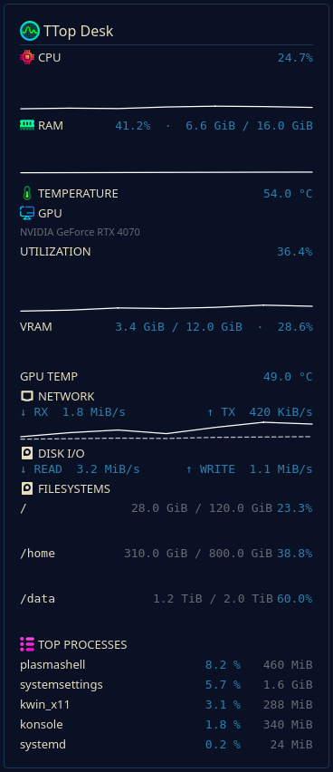

# TTop Desk

TTop Desk is a lightweight KDE Plasma 5 system-monitor widget with live native
metrics, an optional local process/NVIDIA GPU backend, history graphs, and
per-widget customization. Version 0.9.0 is the first public beta candidate.



<p align="center">
  
</p>

## Supported environment

- Linux with KDE Plasma **5.27** and Qt **5.15**
- Primary validation: Linux Mint based on Ubuntu 24.04, Plasma 5.27.12
- User-level installation only; no root access or `sudo`
- Plasma 6 is not supported by the 0.9.x release line

## Features

- CPU utilization, RAM usage, and CPU/package temperature
- Network RX/TX, disk read/write throughput, and filesystem capacity
- NVIDIA GPU utilization, VRAM, and temperature through optional NVML
- Bounded read-only Top Processes with CPU and RSS memory
- Full and compact representations with live history sparklines
- Configurable sections, refresh rates, process sorting, appearance, spacing,
  opacity, compact graphs, and widget title
- Per-widget English, German, or system-default language
- Theme-aware colors, accessibility descriptions, and HiDPI-safe graphs

CPU, RAM, temperature, network, disk-I/O, and filesystem metrics use Plasma
APIs and work without the backend. Top Processes and NVIDIA GPU monitoring use
a private `systemd --user` service and mode-`0600` Unix socket. The backend
does not use TCP, root privileges, or full process command lines.

## Quick install from a release bundle

TTop Desk 0.9.0 targets KDE Plasma 5.27 and Qt 5.15. After obtaining the Linux
release archive:

```bash
tar -xzf ttop-desk-0.9.0-linux.tar.gz
cd ttop-desk-0.9.0-linux
./install.sh
```

The installer checks the bundle, Plasma 5, `kpackagetool5`, Python 3, `psutil`,
and the systemd user session. It installs or upgrades only current-user files,
preserves existing widget settings, and enables the backend automatically.
Running it again performs a safe idempotent upgrade. Add **TTop Desk** from
Plasma's widget selector if it is not already on the desktop.

NVIDIA's NVML library is optional. Without it, installation succeeds, Top
Processes remains available, and only NVIDIA GPU data reports unavailable.
CPU, RAM, temperature, network, disk-I/O, and filesystem metrics remain native
Plasma metrics and work while the backend is stopped.

To uninstall runtime files without deleting Plasma configuration, run
`./uninstall.sh` from the extracted bundle. Backend status and logs are
available through:

```bash
systemctl --user status ttop-desk-backend
journalctl --user -u ttop-desk-backend -f
```

After a native runtime upgrade, an already-running widget may need to be
reopened or removed and added again. The installer never restarts the Plasma
desktop or changes the system locale.

## Requirements

The release installer requires Plasma 5, `kpackagetool5`, Python 3 with
`psutil`, and a working systemd user session. It reports missing dependencies
but never installs distribution packages automatically. NVIDIA's
`libnvidia-ml.so.1` is optional.

For direct repository development, the system additionally needs:

- KDE Plasma 5 and the Plasma Framework runtime
- `plasmoidviewer` from the Plasma SDK (`plasma-sdk` on Ubuntu-family systems)
- `kpackagetool5` from the Plasma Framework tools
- CMake, a C++ compiler, Qt 5 Core/QML/Network development files, and
  `extra-cmake-modules` to build the small Unix-socket QML bridge
- Plasma 5 development files (commonly `libkf5plasma-dev`)
- KDE Frameworks 5 localization development files and gettext tools (commonly
  `libkf5i18n-dev` and `gettext`)

Package names can vary between distributions. This repository does not install
or modify system packages.

## Known limitations

- Plasma 6 is not supported yet.
- GPU metrics currently support NVIDIA/NVML only; AMD and Intel providers are
  future work.
- Top Processes and NVIDIA GPU metrics require the user backend.
- KDE Store publication has not been performed.
- Existing widget instances may need to be reopened or removed and added again
  after a native runtime upgrade. The installer does not restart Plasma.

## Widget settings and representations

Open the settings by right-clicking TTop Desk and choosing **Configure TTop
Desk…**. Changes apply to the running widget and are stored by Plasma; no Plasma
restart is required.

The settings groups are **General**, **Display**, **Metrics**, **Graphs**,
**Processes**, **Refresh**, and **Appearance**. The visible title defaults to
`TTop Desk`, is trimmed to 40 characters, and can be edited without changing
the plugin ID. Header, CPU, RAM, temperature, network, disk I/O, filesystems,
Top Processes, metric icons, and section labels are enabled by default.

**Language** is a per-widget setting with **English**, **Deutsch**, and
**System default** choices. English is the deliberate default even on a German
desktop. The choice applies immediately, persists with that widget instance,
and does not change the Plasma or operating-system locale. CPU, RAM, GPU, RX,
TX, VRAM, process names, mount paths, GPU model names, and numeric values remain
technical data rather than translated content.

CPU, memory, and filesystem progress bars can be hidden independently. Network
receive/transmit and disk read/write values can also be selected separately.
Process CPU and RSS columns are optional; if both are hidden, process names
remain visible. Hidden sections and controls contribute no layout height.

GPU display is enabled by default. GPU utilization, VRAM, temperature, and GPU
progress bars can be hidden independently, and its refresh interval can be
500 ms, 1, 2, or 5 seconds. Compact details optionally add only GPU utilization.

CPU, memory, GPU utilization, and combined network RX/TX sparklines are enabled
by default and can be hidden together or independently. History length is 60
samples by default, with 30 and 120 also available. Samples follow existing
metric refresh events without an additional timer. History is bounded,
in-memory only, and discarded with the widget; it is not telemetry and is not
written to disk. If the backend stops, GPU history pauses and clears while
CPU, RAM, and network histories continue normally.

Each full graph has a concise tooltip and accessibility description; current
numeric labels remain authoritative. Network receive uses a solid line and
transmit uses a dashed, slightly subdued line. Sparkline colors prefer the
Plasma highlight but fall back to theme text color when it provides safer
contrast against the configured card background.

Compact graphs are disabled by default, preserving the Milestone 1.13 panel
layout. Enabling **Show graphs in compact view** adds one 12-pixel history line
without changing the compact representation's preferred dimensions. The
selector offers CPU, memory, GPU, or network; unavailable, disabled, or
undersized selections hide gracefully without rewriting the saved choice.

The read-only process section displays 3, 4, or 5 rows, refreshes every 1, 2,
or 5 seconds, and can sort by CPU or resident memory. The provider sends the
selected sort and exact visible limit in its bounded backend request. CPU values
are not clamped to 100%, and memory uses RSS formatted in MiB or GiB.

Live Plasma metrics refresh at 500 ms, 1, 2, or 5 seconds. Filesystems refresh
at 5, 10, 15, 30, or 60 seconds and display 1–5 filtered rows. Compact and dense
spacing controls reduce gaps without changing font size. **Show network and
temperature details** controls those values in the compact representation.

The full card uses the Plasma theme background by default. Its opacity can be
set from 35% to 100% in 5% steps. Turning off the theme background enables a
validated hexadecimal custom color; normal text continues to use Plasma theme
colors for light/dark compatibility. All changes apply live without restarting
Plasma or the backend.

When the backend socket is unavailable, GPU and Top Processes report
`Backend unavailable` while Plasma-native metrics keep updating. When the
backend is connected but NVML, the NVIDIA driver, or a supported device is not
available, only the GPU section reports `GPU unavailable`.

Example configurations:

- **Minimal:** enable only CPU and RAM.
- **Full:** leave every section and sub-element enabled.
- **Process-focused:** enable CPU, RAM, and Top Processes; choose CPU or memory
  sorting and 3–5 rows.

In a panel, the compact representation prioritizes CPU and RAM percentages.
It lays values out in a row for horizontal panels and stacks them for vertical
panels where practical. Filesystem rows and detailed disk I/O are deliberately
omitted from this small view. Click the compact widget to open the full view.

On the desktop, resize the widget beyond its compact threshold to use the full
card. Its preferred height follows the enabled sections, so hidden sections do
not leave large gaps. Filesystem rows are ordered by mount priority and bounded
by the configured entry limit.

## Test locally

First start the backend in terminal 1:

```bash
cd backend
python3 -m ttop_backend.main --debug
```

Then build the persistent Qt Unix-socket bridge and launch the widget in
terminal 2:

Run the widget directly from the repository:

```bash
./scripts/test.sh
```

The equivalent direct command is:

```bash
./scripts/build-bridge.sh
plasmoidviewer -a "$(pwd)/package"
```

Release contributors can run the complete non-destructive check suite with:

```bash
./scripts/release-check.sh
```

Localization updates, screenshot scenarios, baseline review, scale-factor QA,
and dark/light theme validation are documented in
[`CONTRIBUTING.md`](CONTRIBUTING.md). Visual captures are opt-in through
`./scripts/release-check.sh --visual` and never overwrite baselines.

The local install and upgrade helpers install/update and restart the user
backend service. If it is absent, starting, or stopped, only backend-powered
GPU and **TOP PROCESSES** change state; every Plasma-native metric continues to
work. Unavailable connections retry after five seconds rather than in a tight
loop.

### Backend user service

The development installer generates a user unit containing the resolved
repository and Python paths. It writes only
`~/.config/systemd/user/ttop-desk-backend.service`, requires no `sudo`, and
enables and starts the backend only for the current user. Running it again
safely updates the absolute repository/Python paths and restarts the service:

```bash
./scripts/install-backend-service.sh
```

Common lifecycle commands are:

```bash
./scripts/backend-status.sh
systemctl --user stop ttop-desk-backend
systemctl --user start ttop-desk-backend
systemctl --user restart ttop-desk-backend
journalctl --user -u ttop-desk-backend -f
./scripts/uninstall-backend-service.sh
```

The service uses the same mode-`0600` Unix socket, opens no TCP port, runs
without `User=` or elevated privileges, restarts after unexpected failure with
a two-second delay, and shuts down cleanly on SIGTERM. Plasma-native metrics do
not depend on the unit. The unit deliberately avoids `PrivateTmp`: on enforced
Plasma AppArmor profiles, placing the socket server in a separate mount
namespace makes the otherwise user-owned runtime socket appear as a
"disconnected path" and prevents `plasmashell` from connecting.

### Metric discovery debugging

Plasma 5 system-monitor sensor names can differ between releases and
installations. TTop Desk checks several known CPU and physical-memory source
names and discovers network interfaces, temperature sensors, and filesystem
capacity sources from the runtime sensor tree. Each metric displays
`Unavailable` when no compatible source responds.

For network throughput, TTop Desk prefers complete per-interface receive and
transmit rate pairs. It aggregates all eligible pairs, supporting simultaneous
Ethernet and Wi-Fi without adding a separate all-network sensor and thereby
double-counting traffic. A reliable aggregate pair is used alone only when no
eligible per-interface pair exists. Direct byte-rate sensors are preferred;
cumulative counters are converted to rates from consecutive samples when
necessary.

Loopback and common virtual, bridge, and tunnel prefixes such as `docker`,
`veth`, `virbr`, `vmnet`, `br-`, `tun`, `tap`, and `wg` are ignored. VPN and
unfamiliar virtual-interface handling is intentionally conservative: unknown
interfaces are not rejected merely because their names are unfamiliar.

For disk I/O, TTop Desk discovers complete read/write pairs and chooses one
mutually exclusive strategy. Recognizable whole physical block devices are
aggregated per device when available; otherwise a complete `disk/all` pair is
preferred over partitions, device-mapper aliases, RAID aliases, or opaque
volume identifiers. Aggregate and per-device values are never mixed. When a
whole-device pair exists, corresponding partition pairs are ignored. Common
virtual devices such as `loop`, `ram`, `zram`, optical `sr`, and floppy `fd`
devices are filtered.

Direct byte-rate sensors are preferred and cumulative byte counters are
converted from consecutive samples. Sector or block counters are accepted only
when Plasma exposes an explicit, plausible size sensor for the same device;
ambiguous counters are rejected. Counter resets, stale intervals, negative
deltas, and first samples are handled without manufacturing throughput values.

For CPU temperature, TTop Desk selects one representation rather than mixing
package and core sensors. Its preference order is: CPU package, AMD Tctl/Tdie,
x86 package, CPU aggregate, average of distinct valid CPU cores, then a single
core. Values outside -20–150 °C are rejected rather than clamped. Direct Celsius
and millidegree-Celsius payloads are supported. If a package-level source is
unavailable but several core sensors remain valid, their average is displayed.
Synthetic CPU temperature entries that report both a zero value and a zero
maximum are treated as unavailable placeholders until a valid sample arrives.

Temperature availability depends on kernel hardware-monitor drivers and the
lm-sensors data exposed to Plasma. Missing support is handled gracefully and
does not affect CPU, memory, or network metrics. GPU and disk temperatures are
intentionally excluded from this milestone.

For filesystem capacity, TTop Desk discovers mount-specific `used`, `free` or
`available`, `total`, and percentage sensors. It prefers calculating percentage
from used and total bytes; total minus available is used when a direct used
value is absent, and a direct percentage is the final fallback. Values are
formatted in KiB, MiB, GiB, or TiB. Up to the configured number of unique
mounts are displayed (three by default), ordered as `/`, `/home`, `/data`, then
other meaningful persistent mounts.

Mounts are deduplicated by normalized mount path. When several source groups
describe the same mount, the group with the most complete used/total data wins.
Aggregate disk entries are never mixed with mount-specific entries. Known
virtual and transient filesystem types and paths—such as proc, sysfs, tmpfs,
overlay, `/run`, and `/snap`—are ignored. Unknown entries are included only
when Plasma exposes enough metadata to infer a meaningful mount path. Some
Plasma 5 installations expose filesystem labels instead of paths; the provider
maps explicit `root`, `home`, and `data` labels (plus common OS-volume labels)
to their conventional mount paths rather than guessing arbitrary locations.

To inspect discovery, temporarily set `debugMetrics` to `true` near the top of
`package/contents/ui/main.qml`, then launch the widget. Startup logging includes
advertised system-monitor sources, discovered network candidates, ignored
interfaces and reasons, selected CPU and memory sources, selected network RX/TX
pairs, temperature candidates and rejection reasons, filesystem candidates and
ignored entries, disk-I/O candidates and device classifications, duplicate
filtering decisions, selected mounts and capacity sources, selected disk-I/O
strategy and sources, the selected temperature category, and whether rate
sources are direct values or cumulative counters.
Return the property to `false` after troubleshooting to keep normal Plasma logs
quiet.

### Process sensor capability probe

Milestone 1.7a includes `ProcessProvider.qml` without instantiating it in the
production widget. Run its development-only Plasma harness with:

```bash
plasmoidviewer -a "$(pwd)/tests/process-probe"
```

The probe discovers process-related `systemmonitor` sources, inspects aggregate
arrays or maps and per-process sensor families, and prints high-level structure
information plus at most five normalized examples. It does not read `/proc`,
run process-list commands, or expose command-line arguments. CPU normalization
is provisional when source metadata does not define whether values are
system-wide percentages, per-core percentages, or another raw scale; finite
non-negative values are preserved without clamping to 100%. Resident/RSS
memory is emitted only when byte units can be determined safely.

On the primary Plasma 5.27.12 validation host, neither the legacy
`systemmonitor` DataEngine nor the native KSysGuard sensor tree advertised a
process-related source. Consequently there was no runtime process payload
structure or field set to normalize, CPU and resident-memory process values
were unavailable, and the provider cleanly reported `unavailable`. On this
host, Milestone 1.7b is not viable using Plasma system-monitor sensors alone.

Follow relevant Plasma and QML messages with:

```bash
journalctl --user -f | grep -Ei "plasmashell|plasmoid|qml|ttop"
```

For manual hardware-sensor diagnosis, users may also run:

```bash
sensors
ls /sys/class/hwmon
```

These commands are not run by TTop Desk.

For manual filesystem comparison and mount diagnostics, users may run:

```bash
findmnt
df -hT
```

These commands are also never invoked by the widget.

For manual disk-I/O sensor comparison, users may run:

```bash
lsblk
iostat
cat /proc/diskstats
```

These commands are not invoked by TTop Desk. `iostat` may not be installed on
every system and is not required by the widget.

## Install, upgrade, and uninstall

The commands below are development-checkout helpers. End users should use the
release bundle's `install.sh` and `uninstall.sh` described in **Quick install**.
Install the current repository package for the current user:

```bash
./scripts/install.sh
```

Upgrade an existing installation after making changes:

```bash
./scripts/upgrade.sh
```

Remove the widget:

```bash
./scripts/uninstall.sh
```

No command above requires `sudo`. After installation, add **TTop Desk** from
Plasma's widget browser.

## Optional CMake installation

The package can also be staged through the standard Plasma 5 CMake workflow:

```bash
cmake -S . -B build
cmake --build build
cmake --install build
```

The shell scripts remain the quickest development path.

## Architecture

`main.qml` owns the single `MetricsProvider` instance, validates configuration
values, and wires it into `CompactRepresentation.qml` and
`FullRepresentation.qml`. `MetricsProvider.qml` isolates DataEngine discovery, network-interface
selection and aggregation, temperature preference and core averaging,
filesystem discovery and deduplication, physical-disk selection, disk-I/O
aggregation, counter-to-rate conversion, the native Plasma 5 sensor fallback,
defensive value parsing, normalization, and formatting from the presentation.
`MetricRow.qml` provides percentage metric displays, `NetworkRow.qml` presents
throughput without a fake progress scale, `TemperatureRow.qml` presents the
selected thermal value, `FilesystemRow.qml` presents mount capacity with a real
percentage scale, `DiskIoRow.qml` presents disk throughput without a fake
percentage. `SectionHeader.qml` provides consistent theme-aware section titles,
status text, and optional semantic icons. This boundary leaves room for a later
shared TTop Core adapter without coupling system data collection to the
Plasma-specific visual components.

`ProcessProvider.qml` is a separate, currently uninstantiated capability layer
for Milestone 1.7a. It performs bounded startup/recovery discovery, defensive
array/map/nested-map normalization, PID deduplication, and stale per-process
record expiry. The development probe lives under `tests/` and is not installed
with the widget package.

Milestone 1.8 introduced a minimal local, read-only TTop backend foundation for
advanced metrics that Plasma 5 cannot provide. Process monitoring is its first
data source; future advanced sensors can extend the versioned protocol without
replacing working Plasma-native metrics. It communicates only through a
restrictive per-user Unix-domain socket, opens no network ports, needs no
elevated permissions. Milestone 1.9 connects it through a small in-process Qt
5 `QLocalSocket` QML bridge. The bridge sends the protocol-v1 bounded request
`{"command":"processes","sort":"cpu","limit":5}` by default, substitutes
the configured `cpu`/`memory` sort and 3–5 row limit live, and falls back to
`snapshot` for older backends; it never launches Python or another process and
never opens a TCP port. `BackendProvider.qml` validates, metric-sorts, deterministically
tie-breaks, and bounds the display model before the full representation reads
it. Backend architecture, protocol, manual commands, and privacy details are documented in
[`backend/README.md`](backend/README.md).

GPU requests use `{"command":"gpu"}` on the same socket bridge. The backend
owns one provider instance, initializes NVML once, and shuts it down when the
backend exits. NVIDIA is the only implemented provider; the boundary can
accommodate AMD or Intel implementations in a future milestone.

The UI receives only PID, process name, CPU percentage, and RSS bytes. Username
may exist in the backend snapshot but is intentionally discarded at the QML
provider boundary. Command lines, environments, paths, files, and connections
are never requested or displayed.

Legacy `mem/physical/*` values without unit metadata are assumed to be KiB,
matching Plasma 5's KSysGuard sensor convention. Explicit unit metadata always
takes precedence. Bare percentage values are treated as 0–100 unless their
payload metadata identifies a 0–1 ratio.
Filesystem capacity values without explicit units are assumed to be bytes,
matching Plasma 5's native disk sensors; recognized binary and decimal unit
suffixes override that assumption.
Modern `disk/*/read` and `disk/*/write` values without unit metadata are assumed
to be direct bytes-per-second rates, matching Plasma 5's native disk plugin.

## License

TTop Desk is licensed under the GNU General Public License, version 3 or later.
See [LICENSE](LICENSE).
